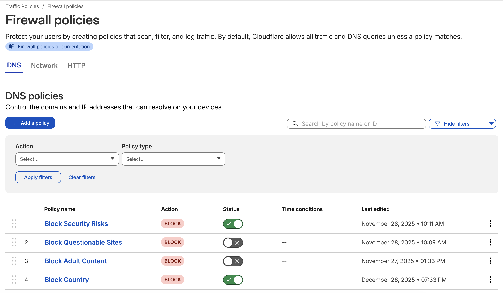
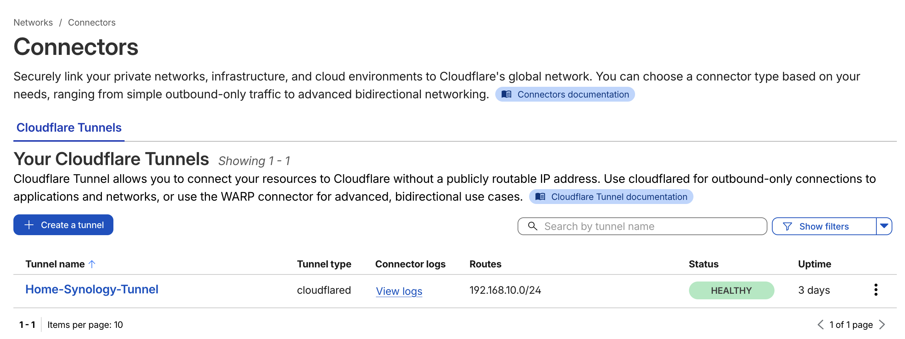
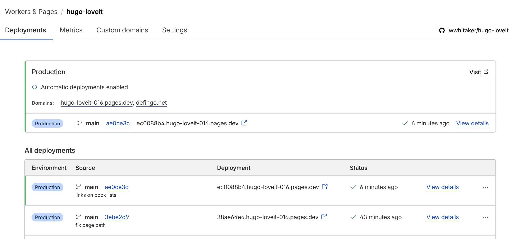

+++
title = 'Cloudflare Overview'
description = ''
date = '2026-03-20'
draft = false
tags = ['homelab', 'networking', 'cloudflare', 'dns']
categories = ['Homelab']
+++

Cloudflare fills 3 roles for my homelab, although I haven't finished digging through their product suite to find more neat tools.

## DNS Firewall

Most people know of Cloudflare's public 1.1.1.1 DNS resolver, but if you take a look deeper into their Zero Trust product suite you'll find their Gateway product.  You can identify your traffic specifically and apply a custom DNS based firewall policy.  The one I use at home is below.

This works well with Unifi's DNS Guard product, which you can tie to your Cloudflare accounts DNS over HTTPS service for more privacy.

## Access Tunnels

You'll find plenty of documentation around Cloudflare Tunnels, but you'll also find they are very useful.  For my homelab, I can expose individual applications to the greater Internet but also apply access policies for identity providers, service tokens, or more general rules like country blocking.

## Content Hosting

My first exposure to Cloudflare was with their content delivery network.  I learned they can easily host static websites and integrate nicely with GitHub.  That allowed me to spin up this site with their Pages product.

## Wrap Up

The cool thing about Cloudflare is that I'm still on the "free" tier of service for everything I use.  The only exception is their DNS registrar service but that's something I'd have to pay anywhere.  I'd recommend looking into it.
