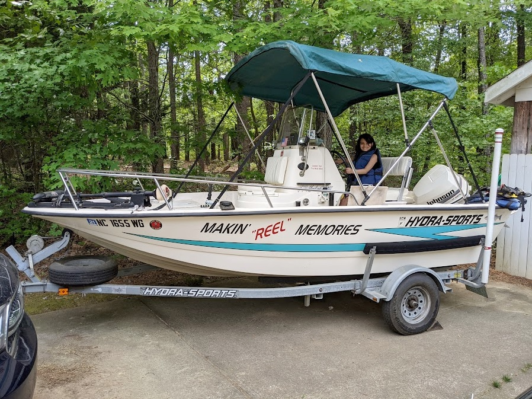
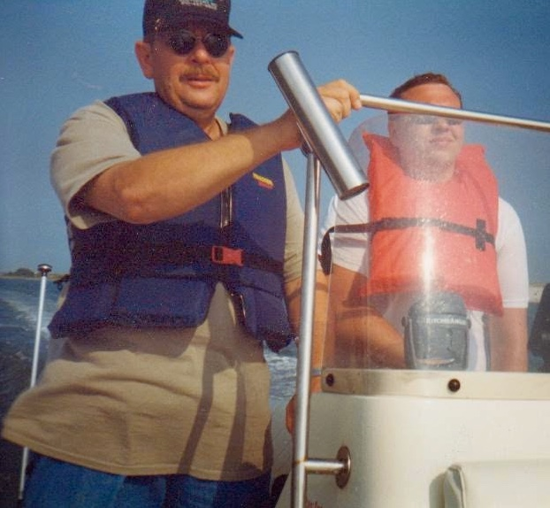

+++
date = '2021-05-02T11:52:57-04:00'
draft = false
title = "Makin' \"Reel\" Memories"
tags = ['boat', 'family']
categories = ['Personal']
+++

A lot of things remind me of Dad, but this more than most.

He would smile when telling a story about me, as a two-year-old, bundled up in the bow of a boat while duck hunting. I don't know much about that, but my earliest outdoor memories with him are fishing perch and bluegill at Belews Lake. Jason and I learned about spoon scaling afterwards.

In high school he floated a flat bottom jon boat with my uncle to join me first time kayaking the Dan River. Later trips, he shuffled my buddies and I between put in and take out spots.

I enjoyed listening to his stories about fishing trips to the coast and Santee Cooper with his buddies. He enjoyed listening to my story of breaking down in his boat on Jordan Lake with my buddies. He introduced Jason and I to Black's Camp and the best place to get a steak after a day out on the lake with friends.

Until his health couldn't handle it, he and Mom pulled this boat to the coast monthly with a stop in Raleigh for a visit and mid-morning breakfast at Golden Corral. "Makin' Reel Memories" was his pick of a name. It was fitting.

He taught me about running this boat, freshwater and salt. He taught me about companionship, family and friends. That's the trick about being on the water, the quality time and being able to carry it with you.

